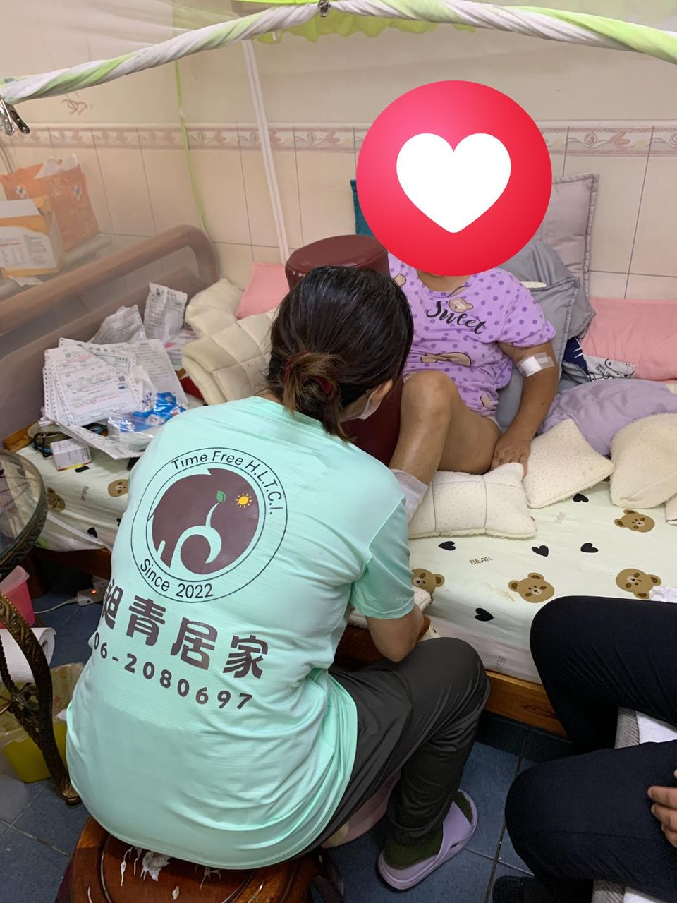
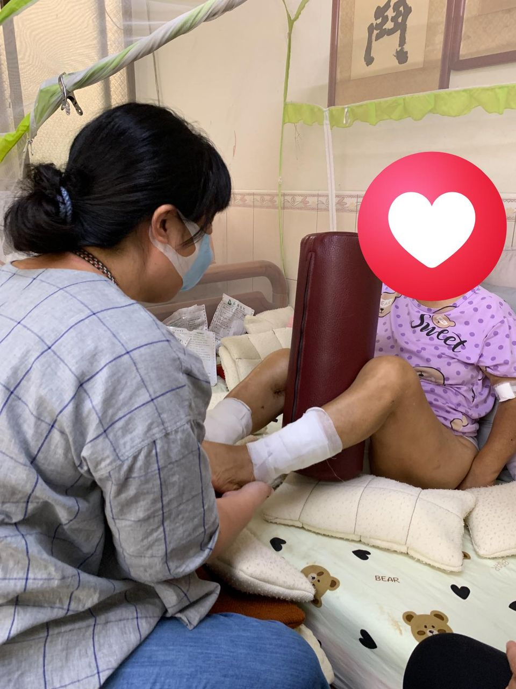

+++
title = "還在把醫院復健跟居家復能混為一談嗎"
date = "2024-11-14T13:39:23+08:00"
tags = ["公告", "崇愛"]
categories = ["公告"]
banner = "../../img/banners/banner-ltcclass.png"
authors = ["管理員"]
+++

還在把醫院復健跟居家復能混為一談嗎？
復能包含日常運動及改變日常生活型態、環境改
造，輔具使用教學等，一步步慢慢改善個案生活自
理能力。
目標如下⬇️⬇️⬇️
起床時能自行穿衣襪
能安全行走到浴室如廁
可以去隔壁鄰居家聊天
可外出購物
主要以「日常生活功能」為目標
此個案在居家進場後沒多久不小心跌倒了
藉由我們家的專業復能進場
慢慢讓阿嬤找回當初的生活型態



### #手把手教學
### #臺南昶青居家長照
### #臺南崇愛居家長照
### #居家復能
### #居家服務

